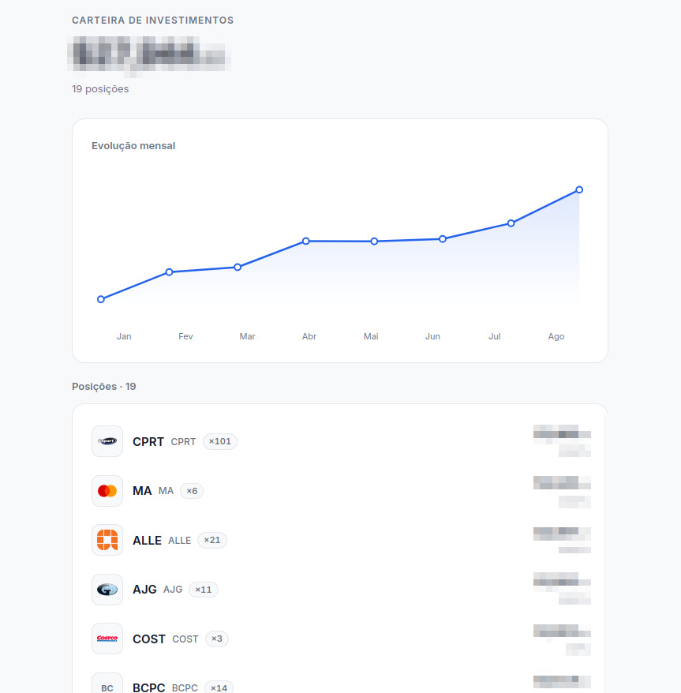
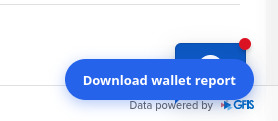
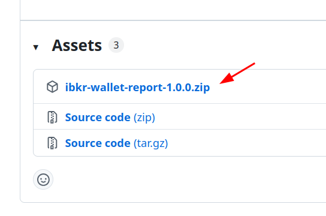

# Relatório de Carteira IBKR

Extensão gratuita para o **Portal do Cliente IBKR**. Com um clique, ela baixa um arquivo HTML com o resumo da sua carteira.

> Ferramenta não oficial. Não tem ligação com a Interactive Brokers.

---

## Privacidade

- Lê apenas as páginas do Portal IBKR enquanto você está logado
- **Não** envia sua carteira para nenhum servidor
- **Não** pede senha, API key ou dados da IBKR
- Não é afiliada à Interactive Brokers

---

## O que faz

- Mostra um botão **Download wallet report** no Portal do Cliente
- Coleta o gráfico do Dashboard e suas posições
- Baixa um arquivo **`carteira-AAAA-MM-DD.html`** que você abre no navegador

O relatório inclui valor total, gráfico mensal e lista de ações ordenada por valor.

Exemplo do arquivo gerado:

---

## Como usar (depois de instalar)

1. Entre no [Portal do Cliente IBKR](https://www.interactivebrokers.com/portal)
2. Clique no botão azul **Download wallet report** (canto inferior direito)
3. Aguarde: **Collecting chart…** → **Collecting positions…** → **Done**
4. Abra o arquivo `carteira-….html` **no navegador** (Chrome, Firefox, Edge, etc.) — clique duas vezes no arquivo ou arraste para uma janela do navegador

---

## Como baixar e instalar

### 1. Baixar

1. Abra a página de **[Releases](https://github.com/joaovictornsv/ibkr-report-generator/releases)** do projeto
2. Baixe o arquivo **`ibkr-wallet-report-X.Y.Z.zip`** — **não** baixe “Source code”

3. **Extraia** o zip para uma pasta fixa. Exemplos:

   - **Windows:** clique direito no zip → **Extrair tudo…** → escolha uma pasta (ex.: `Documentos\ibkr-wallet-report`)
   - **Mac:** duplo clique no zip (o Finder cria uma pasta) → se quiser, mova para `Documentos/ibkr-wallet-report`
   - **Linux:** clique direito no zip → **Extrair aqui** ou **Extrair para…** → escolha uma pasta (ex.: `~/ibkr-wallet-report`)

4. **Não apague** essa pasta depois — o navegador continua usando ela

Dentro da pasta extraída deve existir o arquivo **`manifest.json`**.

---

### 2. Chrome, Edge ou Brave

1. No navegador, abra **`chrome://extensions`** (Edge: `edge://extensions` · Brave: `brave://extensions`)
2. Ative o **Modo do desenvolvedor**:
   - **Chrome / Brave:** interruptor no canto **superior direito** da página
   - **Edge:** interruptor **Modo do desenvolvedor** (canto inferior esquerdo ou superior, conforme a versão)
3. Clique em **Carregar sem compactação** (Load unpacked) — no Chrome/Brave costuma aparecer no canto **superior esquerdo** depois de ativar o modo desenvolvedor
4. Selecione a **pasta extraída** (a que contém `manifest.json`)
5. Confira se **IBKR Wallet Report** aparece na lista, sem erro

---

### 3. Firefox ou LibreWolf

No Firefox e no LibreWolf a instalação é **temporária** — repita estes passos **depois de fechar o navegador**.

1. Abra **`about:debugging#/runtime/this-firefox`**
2. Clique em **Load Temporary Add-on…** / **Carregar extensão temporária…**
3. Dentro da pasta extraída, escolha o arquivo **`manifest.json`**
4. Confira se **IBKR Wallet Report** aparece na lista, sem erro

---

## Problemas comuns

| Problema | O que fazer |
|----------|-------------|
| Botão não aparece | Atualize a página do Portal. No Firefox/LibreWolf, carregue a extensão de novo. |
| Erro ao instalar | Confira se **extraiu** o zip e escolheu a pasta certa (com `manifest.json` dentro). |
| Não baixou o HTML | Permita downloads do site `interactivebrokers.com` no navegador. |

---

## Para desenvolvedores

Detalhes técnicos, testes e publicação de versões: **[TECH_README.md](TECH_README.md)**
